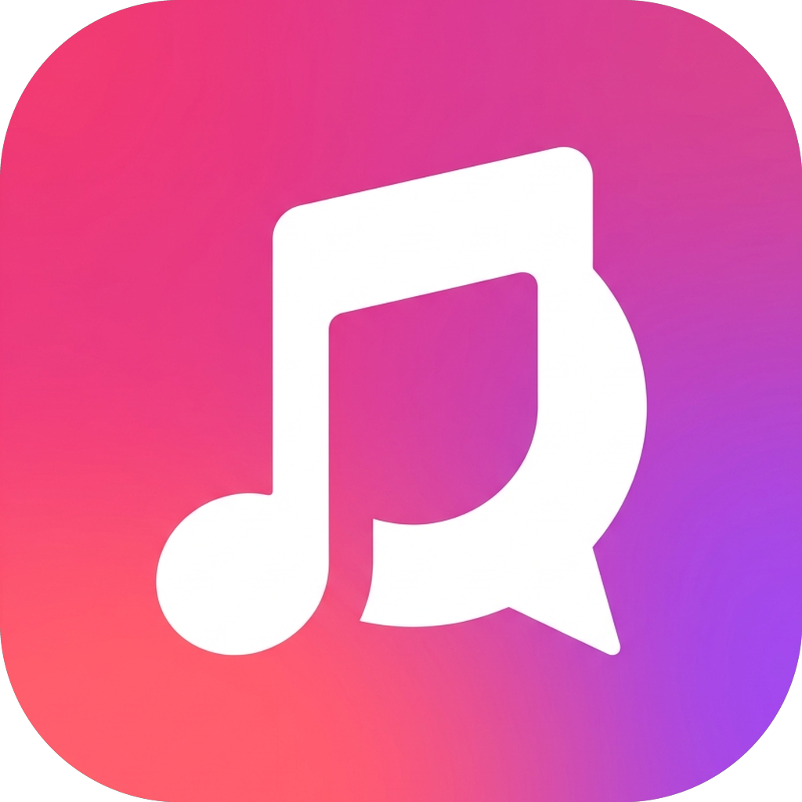

<div align="center">
  
  <h1>LyricLingo (리릭링고)</h1>
  <p><strong>음악을 들으며 자연스럽게 배우는 실시간 AI 가사 번역 & 언어 학습 데스크톱 플레이어</strong></p>

  <p>
    
    
    
    
    
  </p>
</div>

---

## 📖 소개 (Introduction)

**LyricLingo**는 Apple Music과 실시간으로 연동되어 현재 재생 중인 음악의 **타임스탬프 동기화 가사(LRC)**를 자동으로 찾아 표시하고, **AI를 통해 실시간으로 자연스럽게 번역**하며, 가사를 클릭하거나 드래그하여 **단어 학습 및 SM-2 기반 단어장 등록**까지 한 번에 수행할 수 있는 올인원 데스크톱 가사 학습 플레이어입니다.

Apple 특유의 직관적이고 군더더기 없는 글래스모피즘(Glassmorphism) UI를 바탕으로 디자인되었습니다.

---

## ✨ 주요 기능 (Key Features)

### 1. 🎵 Apple Music 실시간 연동 및 제어
- Windows 및 macOS의 Apple Music과 실시간 동기화.
- 현재 재생 중인 곡의 제목, 아티스트, 앨범, 고화질 앨범 아트 및 재생 타임라인 자동 감지.
- 앱 내에서 이전 곡, 재생/일시정지, 다음 곡 등 미디어 컨트롤 완벽 지원.

### 2. ⏱️ 동기화 타임스탬프 가사 (LRC) & 스마트 싱크
- **온라인 자동 취득**: LRCLIB 데이터베이스를 기반으로 곡 길이를 분석하여 가장 싱크가 잘 맞는 가사를 1초 만에 취득.
- **아티스트 일치 검증**: 다른 가수의 동명 곡이 잘못 취득되지 않도록 엄격한 아티스트 격리 필터 적용.
- **다른 가사 버전 탐색**: 싱크나 내용이 다른 여러 버전 중 원하는 버전을 사용자가 직접 검색하고 선택 가능.
- **스마트 싱크(Smart Sync)**: 음악과 가사의 길이 차이를 자동 감지하여 추천 오프셋을 계산, 원클릭으로 간편하게 싱크 보정.

### 3. 🤖 실시간 AI 가사 번역 & 토큰 스트리밍
- **멀티 AI 프로바이더 지원**: 무료로 사용할 수 있는 FreeToken API 및 로컬에서 구동되는 LM Studio/Ollama 지원.
- **실시간 스트리밍 HUD**: 토큰 생성 속도(TPS), 소요 시간, 프롬프트/완성 토큰 수치를 실시간 HUD 카드로 시각화.
- **로컬 SQLite 캐싱**: 이미 한 번 번역된 곡은 로컬 DB에 자동 저장되어 다음 재생 시 즉각 로드 (불필요한 API 호출 방지).

### 4. 🌸 일본어 후리가나(요미가나) 루비 자동 표기
- **Kuromoji 형태소 분석**: 일본어 한자 위에 읽는 법(후리가나)을 문맥에 맞게 루비 태그로 자동 표기.
- **복합어 사전 후처리**: 불완전하게 쪼개지는 한자(`二人` → `ふたり`, `一人` → `ひとり`, 날짜 결합 등)를 자동으로 결합 보정.
- **표기 옵션**: 설정에서 히라가나 / 가타카나 표기 방식 선택 가능.

### 5. 📚 가사 드래그 & 클릭 단어 학습 (AI 튜터 & 단어장)
- **원클릭 단어 분석**: 가사에서 모르는 단어를 클릭하거나 마우스로 드래그하면 AI 튜터 사이드바가 열리며 즉시 뜻, 품사, 예문 분석.
- **유연한 저장 모드**: 선택 즉시 자동 저장 또는 버튼 클릭 수동 저장 모드 토글 지원.
- **SM-2 간격 반복 학습**: 에빙하우스 망각곡선을 반영한 과학적인 SM-2 알고리즘 기반 단어 학습 및 복습 스케줄링.

### 6. 🎨 사용자 중심의 디스플레이 설정
- 메인 가사 및 번역 가사 폰트 크기 조절 (소/중/대/특대).
- 행간 간격 조절 및 목표 번역 언어(한국어, 영어, 일본어, 중국어 등) 선택.

---

## 🛠️ 기술 스택 (Tech Stack)

- **Application Core**: Electron 39, Node.js
- **Frontend**: React 19, TypeScript, Tailwind CSS v4, Lucide React Icons, Recharts
- **Build System**: Vite 7, electron-vite, electron-builder
- **Persistence**: SQLite3 (`lyrics_cache`, `vocabulary` 테이블 관리)
- **Natural Language**: Kuromoji, Kuroshiro (일본어 형태소 분석 및 루비 태그 생성)
- **Testing**: Vitest (단위 테스트), Playwright (E2E 테스트)

---

## 🚀 시작하기 (Getting Started)

### 사전 요구사항
- [Node.js](https://nodejs.org/) (v18 이상 권장)
- [Apple Music](https://www.apple.com/apple-music/) (Windows 앱 또는 macOS 기본 앱 실행 필요)

### 1. 레포지토리 클론 및 의존성 설치
```bash
git clone https://github.com/your-username/LyricLingo.git
cd LyricLingo
npm install
```

### 2. 개발 모드 실행
```bash
npm run dev
```

### 3. 단위 테스트 실행
```bash
npm test
```

### 4. 프로덕션 빌드 및 패키징
```bash
# TypeScript 검사 및 프로덕션 번들 빌드
npm run build

# Windows 설치 프로그램 (.exe) 생성
npm run build:win

# macOS 패키지 (.dmg) 생성
npm run build:mac
```

---

## ⚙️ AI 번역 설정 가이드

앱 우측 상단의 **설정(Settings)** 메뉴에서 AI 번역 환경을 구성할 수 있습니다:

1. **FreeToken 프로바이더**:
   - 별도 설치 없이 무료 토큰 API를 활용하여 클라우드 상에서 빠르고 정확하게 가사를 번역합니다.
2. **LM Studio (로컬 LLM)**:
   - 개인 PC에서 LM Studio를 실행(`localhost:1234`)한 뒤 로컬 모델(Qwen, Gemma, Llama 등)을 선택하여 오프라인에서 무료로 무제한 번역할 수 있습니다.

---

## 📂 프로젝트 구조 (Project Structure)

```text
LyricLingo/
├── src/
│   ├── main/                  # Electron 메인 프로세스
│   │   ├── database/          # SQLite DB 관리 (가사 캐시, 단어장 CRUD)
│   │   ├── utils/             # LRC 파서, 검색기, 미디어 제어, 일본어 사전 보정
│   │   └── index.ts           # IPC 통신 및 백엔드 파이프라인
│   ├── preload/               # 보안 브릿지 (IPC API 노출)
│   ├── renderer/              # React 렌더러 (UI)
│   │   └── src/
│   │       ├── components/    # LyricsPlayer, TutorSidebar, History, Settings 등
│   │       ├── assets/        # 로고 및 정적 이미지 리소스
│   │       └── App.tsx        # 앱 메인 쉘 및 네비게이션
│   └── shared/                # 메인-렌더러 공통 TypeScript 타입
├── build/                     # 앱 아이콘 리소스 (.ico, .icns, .png)
├── _testcode/                 # 격리된 테스트 환경 (specs/, temp/, debug/)
├── electron-builder.yml       # 일렉트론 패키징 설정
└── package.json
```

---

## 📄 라이선스 (License)

This project is licensed under the MIT License.
